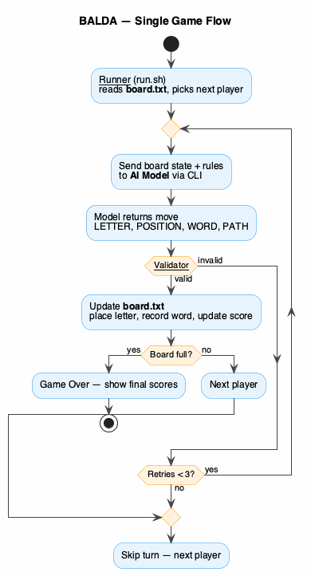
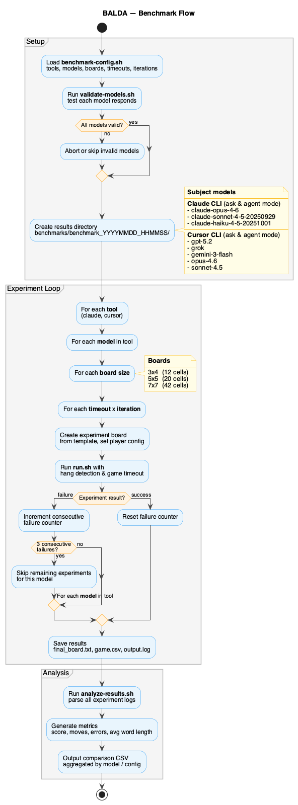

# BALDA Word Game - AI Agent Benchmark

AI agents compete in BALDA, a word-building board game. Multiple AI models (Claude, Cursor-backed) are benchmarked across board sizes and configurations.

## Prerequisites

- **Claude CLI** (`claude`) and/or **Cursor CLI** (`cursor`)
- **Bash 4+**
- **Python 3** (for results aggregation)

## Quick Start

```bash
# Generate board templates
./generate-templates.sh

# Run a single game
./run.sh

# Run full benchmark suite
./validate-models.sh        # verify models respond
./benchmark.sh              # run benchmarks
./analyze-results.sh benchmarks/benchmark_YYYYMMDD_HHMMSS
```

## Files

| File | Purpose |
|------|---------|
| `run.sh` | Game engine — runs one game from `board.txt` |
| `benchmark.sh` | Runs multiple games across models/boards/configs |
| `benchmark-config.sh` | Benchmark configuration (models, board sizes, timeouts, iterations) |
| `generate-templates.sh` | Creates board templates (3x4, 4x4, 5x5, 7x7) |
| `validate-models.sh` | Pre-flight check that configured models respond |
| `analyze-results.sh` | Generates metrics and comparisons from benchmark results |
| `scripts/build_runs_csv.py` | Aggregates experiment logs into a single CSV |
| `AGENT_INSTRUCTIONS.md` | Game rules and output format fed to AI agents |

## Game Flow



The runner reads the board, sends state to the AI model, validates the returned move, and updates the board on success. Invalid moves are retried up to 3 times before skipping the player's turn. The loop continues until the board is full.

## Benchmark Flow



The benchmark harness iterates over tools (Claude CLI, Cursor CLI), models, board sizes (3x4, 5x5, 7x7), timeouts, and iterations. Each combination spawns a full game via `run.sh` with hang detection and automatic timeout. Models run in either **ask** mode (read-only) or **agent** mode (tools enabled), configured per model. After 3 consecutive failures a model is skipped. Results are analyzed into per-model metrics and comparison CSVs.

## Game Rules

- Place **one letter** on an empty cell (`.`) to form a valid English word
- Words must be **B2-level singular nouns**
- Path uses **adjacent cells only** (horizontal/vertical, no diagonals)
- Each cell used at most once; word must include the new letter
- No repeated words within a game
- **Score = word length**

## Board Format

`board.txt` holds the full game state:

```
.....
.....
agent
.....
.....
---PLAYERS---
Alice|claude-opus-4-6|claude|90: 0
Bob|claude-sonnet-4-5-20250929|claude|90: 0
---WORDS---
```

Player format: `Name|model|cli|timeout: score`

## Configuration

CLI paths are auto-detected. Override with environment variables if needed:

```bash
export CLAUDE_CLI=/path/to/claude
export CURSOR_CLI=/path/to/cursor
```

Edit `benchmark-config.sh` to set models, board sizes, timeouts, turn limits, and iteration count.
